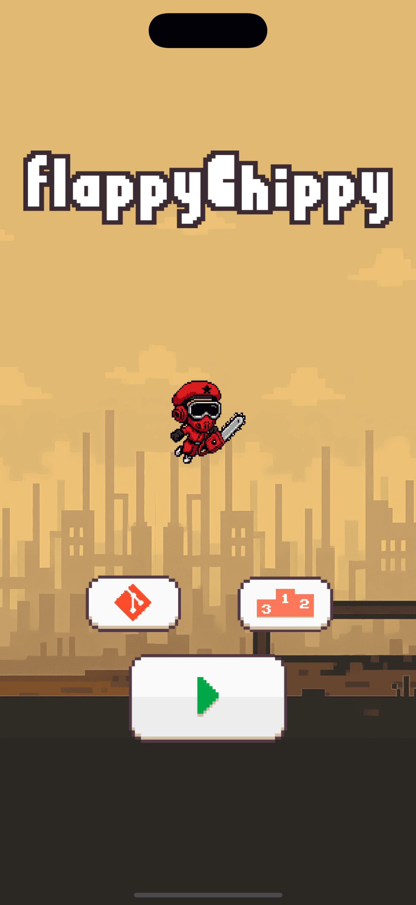

**Flappy Chippy** is a chaotic arcade game featuring **Chippy**, a chainsaw-wielding lumberjack leaping through useless logs in a post-apocalyptic forest.

Built with **Swift** and **SpriteKit**, and powered by [bitdrift](https://bitdrift.io), the mobile observability SDK reimagining how developers monitor and debug mobile applications.

  

**Flappy Chippy** started as a fun side project at [bitdrift](https://bitdrift.io) to test our SDK in a real app — and ended up as a full-fledged game we couldn’t stop playing. Install the game from the App Store & stay tuned for contests and prizes!

## Tech Stack

- **Swift 6.0+**
- **SpriteKit** for physics, animation, and game loop
- **bitdrift SDK** for crash tracking, performance telemetry, and observability

## Getting Started

```bash
git clone https://github.com/bitdriftio/flappy-chippy.git
cd flappy-chippy
open FlappyChippy.xcodeproj
````

Ensure you're using **Xcode 15+** and running on **iOS 17+**.

## SDK Integration

This project uses the [bitdrift SDK](https://bitdrift.io) to track:

* Frame performance
* Crashes
* Hang diagnostics
* Session metrics

You can see how it’s initialized in [`AppDelegate.swift`](./Sources/Controllers/AppDelegate.swift).

Want to add Bitdrift to your app? [Get started here →](https://bitdrift.io)

## 🤘 Built by Bitdrift

bitdrift flips the decades-old mobile observability paradigm on its head. Instead of drowning in costly data that no one looks at, you can log everything, intelligently choose what to store, and gain real-time insights without waiting for an app release.

Learn more at [bitdrift.io](https://bitdrift.io) or follow [@bitdriftio](https://twitter.com/bitdriftio) for updates and contest announcements.
